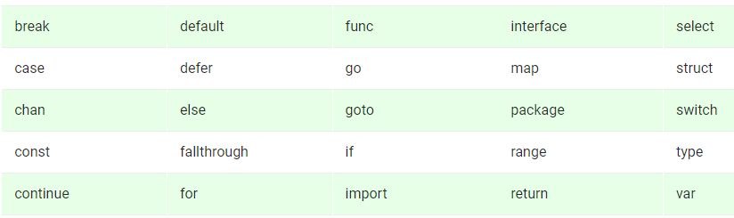

## Go In 3 Hours
This repo is an extract out version of the course Go In 3 Hours as I am trying to learn Go quickly so thought share notes with others that may be helpful.

## Go History
[Go History](./go-basic-info.md)

## Go Installation
[Go Installation](./installing_go.md)

## Validating Go Installation
[Validating Go Installation](./validate-env/validate-environment.md)

## Course GitHub
[Learn Go in 3 Hours](https://GitHub.com/PacktPublishing/learn-Go-in-3-hours)

## Go Keywords

## More Material
1. [An Introduction To programming In Go](https://www.golang-book.com/books/intro)
2. [Golang Tutorial – Learn Go Programming Language](https://www.geeksforgeeks.org/golang-tutorial-learn-go-programming-language/)

