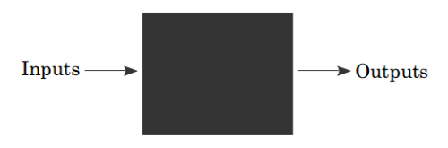

# Functions, CLosures, Recursion, Pointers, Defer, Panic & Recover

A function is an independent section of code that maps zero or more input parameters to zero or more output parameters. Functions (also known as procedures or subroutines) are often represented as a black box: (the black box represents the function).



Functions start with the keyword func, followed by the function's name. The parameters (inputs) of the function are defined like this: name type, name type, …. After the parameters we put the return type. Collectively the parameters and the return type are known as the function's signature.

Finally we have the function body which is a series of statements between curly braces.

## Function Structure

```
func FUNC_NAME(INPUT_PARAM_NAME Param1,INPUT_PARAM_NAME Param2 ... ) (RETURN TYPE1....) {
    .....executes business logic
    return RETURN_VALUE_1, RETURN_VALUE_1, ....
}
```

>Return type(s) is/are optional and so does return statement.

## Few Examples

```
func average(xs []float64) float64 {
  total := 0.0
  for _, v := range xs {
    total += v
  }
  return total / float64(len(xs))
}
```

```
func average(xs []float64) float64 {
  panic("Not Implemented") //Panic is a built-in function called panic which causes a run time error. 
}
```

```
func callMe() { //does not return anything
  xs := []float64{98,93,77,82,83}
  fmt.Println(average(xs))
}
```

```
func f2() (r int) {
  r = 1
  return
}
```

```
func f() (int, int) {
  return 5, 6
}

func main() {
  x, y := f()
}
```

```
func f() (int, int) {
  return 5, 6
}

func main() {
  x, y := f()
  _, y = f()
  x, _ = f()
}
```

> Functions are built up in a “stack”. 
```
func main() {
  fmt.Println(f1())
}
func f1() int {
  return f2()
}
func f2() int {
  return 1
}
```

We can visualize above in stack as below.


## Variadic Functions
There is a special form available for the last parameter in a Go function.
```
func add(args ...int) int {
  total := 0
  for _, v := range args {
    total += v
  }
  return total
}
func main() {
  fmt.Println(add(1,2,3))
}
```

By using ... before the type name of the last parameter you can indicate that it takes zero or more of those parameters. In this case we take zero or more ints. We invoke the function like any other function except we can pass as many ints as we want.
We can also pass a slice of ints by following the slice with ...:
```
func main() {
  xs := []int{1,2,3}
  fmt.Println(add(xs...))
}
```

> This is precisely how the fmt.Println function is implemented:
>>func Println(a ...interface{}) (n int, err error)

>Go doesn't have: function overloading. That means you can't use the same name for two different functions declared in the same scope, even if they have different numbers of parameters or different types of parameters. If you do this Go will think you're trying to read declare the same function in the same scope and you'll get a compiler error.


## Assigning Function to a Variable

```
package main

import "fmt"

func addOne(a int) int {
	return a + 1
}

func main() {
	myAddOne := addOne //assigning function to the var, do not use parenthesis as we are assigning and not calling teh function
	
    fmt.Println(addOne(1))
	
    fmt.Println(myAddOne(1))
}
```

## Function as Param Examples

>Go supports anonymous functions (you cannot defines a sub function within another function with its name)

```
package main

import "fmt"

func main() {
	myAddOne := func(a int) int {
		return a + 1
	}
	fmt.Println(myAddOne(1))
}

//myAddOne is another local var scoped within main function
//var a only accessible within its defined function and not accessible in main
```

```

package main

import "fmt"

func addOne(a int) int {
	return a + 1
}

func addTwo(a int) int {
	return a + 2
}

func printOperation(a int, f func(int) int) { //func as a param
	fmt.Println(f(a))
}

func main() {
	printOperation(1, addOne) //passing func as param
	printOperation(1, addTwo) //passing func as param
}
```

## Closures

Go supports anonymous functions, which can form closures. Anonymous functions are useful when you want to define a function inline without having to name it.

Local functions are more properly called in computer science terms closures. You can think of a closure as a local function that has access to the variables that exist in the environment where it was declared. We will use this closure concept to return a function from a function.

>In the below code, function `intSeq` returns another function, which we define anonymously in the body of intSeq. 
>>`The returned function closes over the variable i to form a closure`.
```
package main

import "fmt"

func intSeq() func() int {
    i := 0
    return func() int {
        i++
        return i
    }
}

func main() {

    /*We call intSeq, assigning the result (a function) to nextInt. This function value captures its own i value, which will be updated each time we call nextInt.
    */
    nextInt := intSeq() //will get its own state of i starting with 0

    fmt.Println(nextInt())  //Output 1
    fmt.Println(nextInt())  //Output 2
    fmt.Println(nextInt())  //Output 3

    newInts := intSeq() //will get its own state of i starting with 0
    fmt.Println(newInts()) //Output 1

    /*Output -> go run closures.go
    * 1
    * 2 
    * 3
    * 1
    */
}
```

```
func makeEvenGenerator() func() uint {
  i := uint(0)
  return func() (ret uint) {
    ret = i
    i += 2
    return
  }
}
func main() {
  nextEven := makeEvenGenerator()
  fmt.Println(nextEven()) // 0
  fmt.Println(nextEven()) // 2
  fmt.Println(nextEven()) // 4
}
```

## Recursion
Finally a function is able to call itself. Here is one way to compute the factorial of a number:

```
func factorial(x uint) uint {
  if x == 0 {
    return 1
  }
  return x * factorial(x-1)
}
```

factorial calls itself, which is what makes this function recursive. In order to better understand how this function works, lets walk through factorial(2):

    Is x == 0? No. (x is 2)

    Find the factorial of x – 1

        Is x == 0? No. (x is 1)

        Find the factorial of x – 1

            Is x == 0? Yes, return 1.

        return 1 * 1

    return 2 * 1


> Closure and recursion are powerful programming techniques which form the basis of a paradigm known as functional programming.

## Pointers
If you've coded in C or C++, pointers are necessary and dangerous things. Developers need to track that usage carefully, and if they don't memory will leak and programs will crash. Pointers and Go there are a lot less scary because many of the scary things that they can do in C and C++ just aren't possible in Go. Go has its own array and string type so you don't use pointer to simulate them. This helps eliminate the buffer overflow errors that can happen in C programs. Go automatically tracks all pointers created in a program, uses garbage collection to take care of de allocating them and there are no more uses. This eliminates both memory leaks and accidental use F and D allocation that can cause random crashes. And because Go is strongly typed it also doesn't let you allocate a bunch of memory and then treat it as any type you feel like, or let you cast one pointer type to another. In general pointers and Go are far safer than pointers in C or C++.

In Go a pointer is represented using the * (asterisk) character followed by the type of the stored value. In the zero function xPtr is a pointer to an int.

`*` is also used to `dereference` pointer variables. Dereferencing a pointer gives us access to the value the pointer points to. When we write `*xPtr = 0` we are saying `“store the int 0 in the memory location xPtr refers to”. If we try xPtr = 0 instead we will get a compiler error because xPtr is not an int it's a *int, which can only be given another *int.

Finally we use the & operator to find the address of a variable. &x returns a *int (pointer to an int) because x is an int. This is what allows us to modify the original variable. &x in main and xPtr in zero refer to the same memory location.

```
package main

import "fmt"

func main() {
	a := 10
	b := &a // assigning var a mem address to b, also knows as reference to a
	c := a
	fmt.Println(a, b, *b, c) //OutPut -> 10 memaddress(b) 10(*b) 10

	a = 20
	fmt.Println(a, b, *b, c) //OutPut -> 20 memaddress(b) 20(*b) 10

	*b = 30
	fmt.Println(a, b, *b, c) //OutPut -> 30 memaddress(b) 30(*b) 10

	c = 40
	fmt.Println(a, b, *b, c) //OutPut -> 30 memaddress(b) 30(*b) 40
}
```

>We can access pointer reference by simply accessing that variable like `b` and it prints out the memory address it refers to. In our example memory address of var `a` is stored inside `b`

>We can access the actual value that pointers belongs to by using `*` symmbol with the pointer variable like `*b`.
>>Its also referred as dereferencing. If you want to see the value that is stored of that memory address you put `*` in front of the variable name to dereference the pointer and get to the value.

```
package main

import "fmt"

func main() {

    /*When you declare a variable this way it's assigned the 0 value for a pointer and all pointers, matter what type they point to, have the same zero value, it's called nil*/

	var b *int //0 value of pointer is Nil

	fmt.Println(b) //accessing Nil will generate a panic that is runtime error
	fmt.Println(*b) //If you try to read or modify the value pointed to by a nil pointer you will get what's called a panic.
}
```

```
func example2() {

	/**
	* First we use builtin new function to create a pointer for the type passed in.
	* Second, new doesn't just make be a pointer it also allocates memory as well.
	*/
	b := new(int) //new takes a type as an argument, allocates enough memory to fit a value of that type and returns a pointer to it.

	fmt.Println(b) //memory location
	fmt.Println(*b) //0 as the default int type value
}
```

So we can also use the built-in a new function to create a pointer, and this is what it looks like. So we've changed line six to a sine B the value returned to by the calling the new function with int as a parameter. There are two important things to notice here. First we pass int 2 nu naught star int, new mix a pointer for the type. Second, new doesn't just make be a pointer it also allocates memory as well if we run the program now it no longer panics. Printing out the value of b returns a memory location and printing out the value pointed to by b returns 0. That's because the value at the memory location is initialized to the 0 value of the type. There's one more thing about pointers i wanted to cover, passing them to a function. We saw in video 3 in this section that Go uses a call-by-value to assign values to the parameters when a function is called, but we just saw that for a pointer the value is the memory location where the value is stored. We can take advantage of that to write functions that are able to change the value of variables in the functions that call them. So let's take a look at this program. On line 5 we have defined a function called set to 10, that is 1 input parameter, a pointer to an int. On line 6 we assign the value 10 to the value pointed to by that pointer. On line 10 in main we define an int variable a. Notice that a is an int not a pointer to an int we print out the value on line 11. We call set to 10, passing a pointer to a into that function, we print out the value of a afterwards. If we run this program we will see we were able to change the value of a by making this function call change from 20 to 10. Now you should realize that Go is still a call-by-value language. Try to make a point to a different memory location in sets of 10, that wouldn't change the value of a in main. So let's look at this new code. So before we run this program let's take a look at what happens on line 6. On line 6 we assign a new end, we assigning it to a brand new pointer, and then on line 7 we are assigning the value stored at a to 10, but remember this is a brand new pointer. And if we try to run this program we will see we were unable to change the value because we tried to change what a was pointing to, and you can't do that because it is a call-by-value language. We're no longer referring to the same memory location in both functions. And well it's much more common and Go for functions to use value parameters, there are some places in the Go standard library where pointers are passed into functions in order to modify the values at the point 2. So in this video we've covered winters and what they are, and how to create them, and how they allow us to pass modifiable parameters to functions. We've learned a lot in this section. We've covered all the control structures and Go, if for and switch, we have learned how to create news functions, and we now know about pointers as well. So after an assessment we're on to the next section, where we will learn about organizing our code with packages and organizing our data with slices maps and structs.

## Defer

Go has a special statement called defer which schedules a function call to be run after the function completes. Consider the following example:

```
package main
import "fmt"

func first() {
  fmt.Println("1st")
}
func second() {
  fmt.Println("2nd")
}
func main() {
  defer second()
  first()
}
```

This program prints 1st followed by 2nd. Basically defer moves the call to second to the end of the function:
```
func main() {
  first()
  second()
}
```

defer is often used when resources need to be freed in some way. For example when we open a file we need to make sure to close it later. With defer:
```
f, _ := os.Open(filename)
defer f.Close()
```

This has 3 advantages: (1) it keeps our Close call near our Open call so it's easier to understand, (2) if our function had multiple return statements (perhaps one in an if and one in an else) Close will happen before both of them and (3) deferred functions are run even if a run-time panic occurs.

## Panic & Recover

>Panic function to cause a run time error.

>We can handle a run-time panic with the built-in recover function. recover stops the panic and returns the value that was passed to the call to panic. 

We might be tempted to use it like this:
```
package main
import "fmt"
func main() {
  panic("PANIC")
  str := recover()
  fmt.Println(str)
}
```

But the call to recover will never happen in this case because the call to panic immediately stops execution of the function. Instead we have to pair it with defer:

```
package main
import "fmt"

func main() {
  defer func() {
    str := recover()
    fmt.Println(str)
  }()
  panic("PANIC")
}
```

A panic generally indicates a programmer error (for example attempting to access an index of an array that's out of bounds, forgetting to initialize a map, etc.) or an exceptional condition that there's no easy way to recover from. (Hence the name “panic”) 