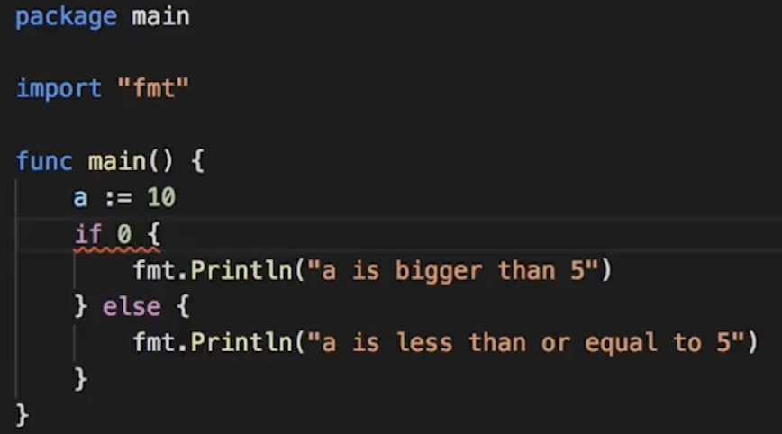
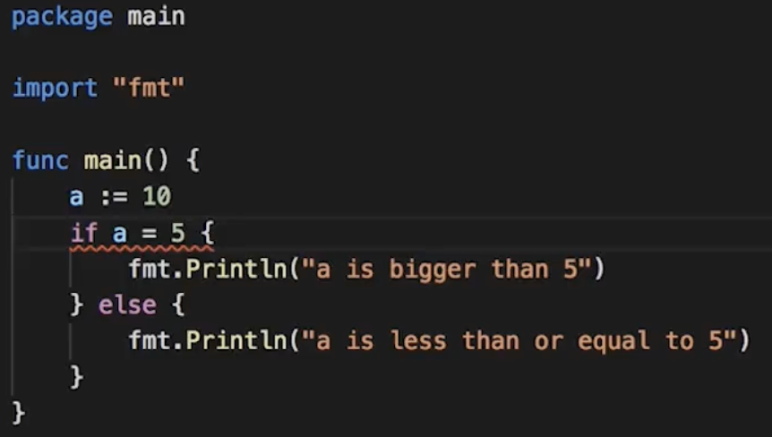
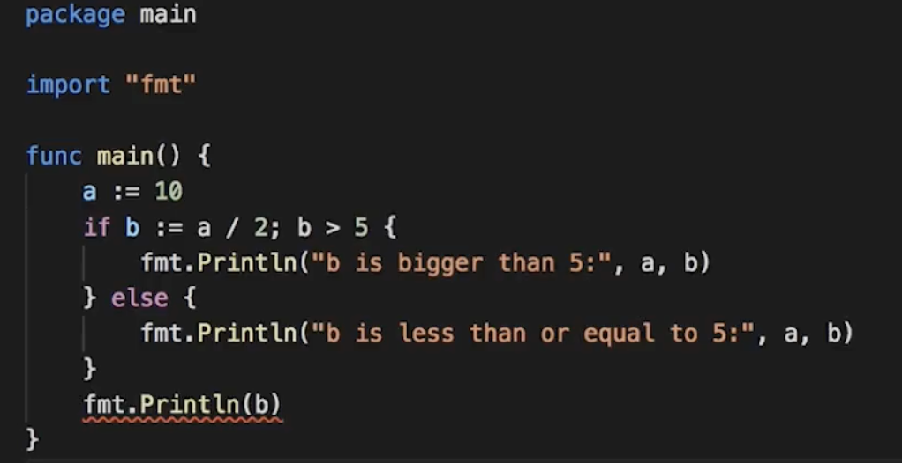

## If, Else and For Loops (Control Structures)

## If/Else
Just like every other procedural language, Go has an if statement that evaluates a boolean condition. If the condition is true the statements inside of the if block are executed, if the condition is false the statements inside of the else block are executed instead. If there's no else then the program just continues.

An `if` statement is similar to a `for` statement in that it has a condition followed by a block. If statements also have an optional `else` part. If the condition evaluates to true then the block after the condition is run, otherwise either the block is skipped or if the else block is present that block is run.

If statements can also have else if parts:

```
if i % 2 == 0 {
  // divisible by 2
} else if i % 3 == 0 {
  // divisible by 3
} else if i % 4 == 0 {
  // divisible by 4
}
```

The conditions are checked top down and the first one to result in true will have its associated block executed. None of the other blocks will execute, even if their conditions also pass. 

```
func main() {
  for i := 1; i <= 10; i++ {
    if i % 2 == 0 {
      fmt.Println(i, "even")
    } else {
      fmt.Println(i, "odd")
    }
  }
}
```

>Go doesn't have truth e values like some languages do. 0 is not equal to false and can't be coerced to false (if you do this, you will see red squiggle underneath the code).


>if you type it single equals in an if comparison instead of using a double equals it's a compiler error and not an assignment


>One thing that Go does let you do that you can't do in a lot of other languages, you can declare new variables before the comparison and use them in the comparison as well as in the body of the if and the else. If you try to use this variable outside of the if statement though you'll still get an error, this is no longer in scope.


## For Loops
The for statement allows us to repeat a list of statements (a block) multiple times.

```
package main

import "fmt"

func main() {
  i := 1
  for i <= 10 {
    fmt.Println(i)
    i = i + 1
  }
}
```

Other programming languages have a lot of different types of loops (while, do, until, foreach, …) but Go only has one that can be used in a variety of different ways. The previous program could also have been written like this:

```
func main() {
  for i := 1; i <= 10; i++ {
    fmt.Println(i)
  }
}
```

```
func main() {
  i := 1
  for i <= 10 {
    fmt.Println(i)
    ++i
  }
}
```

```
func main() {
  i := 1
  for {
    fmt.Println(i)
    i = i + 1
    if ( i > 10 ) {
        break
    }
  }
}
```

```
func main() {
  a :=3
  for i := 1; i <= 10; i++ {
    if i == a {
      continue
    }
    fmt.Println(i)
  }
}

//Output -> 1 2 4 5 6 7 8 9 10 (skip 3)
```

```
func main() {
  a :=5
  for i := 1; i <= 10; i++ {
    if i == a {
      break
    }
    fmt.Println(i)
  }
}

//Output -> 1 2 3 4 (break loop at the index of 5)
```

## For Range loop

The for range loop lets you iterate over some of Go's built-in types if you want to iterate over every character in a string.

>Printing an rune you have to continue a type conversion to string to see the character otherwise you just get as numeric value

```
  s := "👋 🌍"
	for k, v := range s {
		fmt.Println(k, v, string(v))
	}

// k ==> offsets
// s ==> rune

//Output ->
	0 128075 👋 (first emoji is four characters long)
	4 32  (the space is one character long)
	5 127757 🌍 (last emoji is four characters long)
```

## Switch
A switch statement starts with the keyword switch followed by an expression (in this case i) and then a series of cases. The value of the expression is compared to the expression following each case keyword. If they are equivalent then the statement(s) following the : is executed. 

Like an if statement each case is checked top down and the first one to succeed is chosen. A switch also supports a default case which will happen if none of the cases matches the value. (Kind of like the else in an if statement)

```
switch i {
  case 0: fmt.Println("Zero")
  case 1: fmt.Println("One")
  case 2: fmt.Println("Two")
  case 3: fmt.Println("Three")
  case 4: fmt.Println("Four")
  case 5: fmt.Println("Five")
  default: fmt.Println("Unknown Number")
}
```

>In Go, by default, a switch statement will only run the statements that are nested within a single case. In Java and C the switch statements automatically fall through. Once the case matches every statement in every case that follows is also run until you reach a break statement. Once case statement executed, it will not executes following unless we specify using `fallthrough`. Not a good way to do this.

```
package main

import (
	"fmt"
	"os"
)

func main() {
	word := os.Args[1]
	switch word {
	case "hi":
		fmt.Println("Very informal!")
		fallthrough
	case "hello":
		fmt.Println("Hi yourself")
	case "goodbye", "bye":
		fmt.Println("So long!")
	case "farewell":
  case "greetings":
		fmt.Println("Salutations")
	default:
		fmt.Println("I don't know what you said")
	}
}

// Program Input go run p.go hi
//Output ==> 
//  Very informal!
//  Hi yourself


// Program Input go run p.go farewell
//Output ==> (nothing gets printed out)
```

> Most common reason to use fall through behavior in Java or C is when you want the same code executed for cases that match two different values. Go does it differently. If you want to run the same code where multiple values match you put all of the values in the same case separated by a comma. 

```
package main

import (
	"fmt"
	"os"
)

func main() {
	word := os.Args[1]
	switch word {
	case "hi":
		fmt.Println("Very informal!")
		fallthrough
	case "hello":
		fmt.Println("Hi yourself")
	case "farewell":
	case "goodbye", "bye":
		fmt.Println("So long!")
	case "greetings":
		fmt.Println("Salutations")
	default:
		fmt.Println("I don't know what you said")
	}
}

// Program Input go run p.go goodbye
//Output ==> So long!

// Program Input go run p.go bye
//Output ==> So long!
```

> Another difference you can switch and Go and switch in Java and C is that Go does not require the value that you were comparing against in the case statement to be a constant value. Any type of value can be compared. The comparison can be against the variable, a constant, or a literal value. All that matters of the value in the case statement has to be the same type as the value specified for comparison in the switch statement.

```
package main

import (
	"fmt"
	"os"
)

func main() {
	word := os.Args[1]
	c := "crackerjack"
	switch l := len(word); {
	case word == "hi":
		fmt.Println("Very informal!")
		fallthrough
	case word == "hello":
		fmt.Println("Hi yourself")
	case l == 1:
		fmt.Println("I don't know any one letter words")
	case 1 < l && l < 10, word == c:
		fmt.Println("This word is either", c, "or 2-9 characters long")
	default:
		fmt.Println("I don't know what you said but it was", l, "characters long.")
	}
}
```