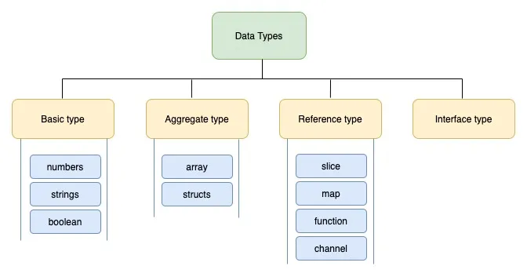
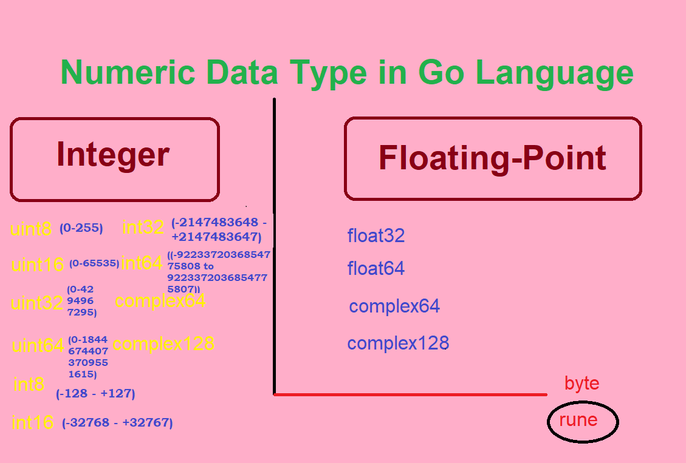
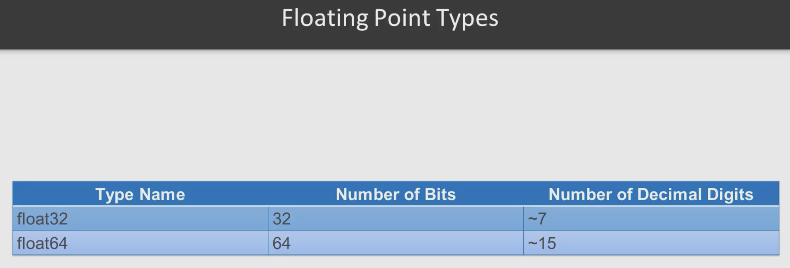

## Numerical Types in GO

Part of below is from https://www.golang-book.com/books/intro/3

### Types

Philosophers sometimes make a distinction between types and tokens. For example suppose you have a dog named Max. Max is the token (a particular instance or member) and dog is the type (the general concept). “Dog” or “dogness” describes a set of properties that all dogs have in common. Although oversimplistic we might reason like this: All dogs have 4 legs, Max is a dog, therefore Max has 4 legs. Types in programming languages work in a similar way: All strings have a length, x is a string, therefore x has a length.

Go is a statically typed programming language. This means that variables always have a specific type and that type cannot change. Static typing may seem cumbersome at first. You'll spend a large amount of your time just trying to fix your program so that it finally compiles. But types help us reason about what our program is doing and catch a wide variety of common mistakes.

Go comes with several built-in data types which we will now look at in more detail.

Go won't automatically convert types (like in Java we can assign int to float and vice versa but not in go). In go, we need to use type conversion syntax to do so.

> In Go, we can have the compiler decide the data type of a variable if we directly assign it a value using :=. This way, we do not always have to hard code the data type of a variable.

### Numbers
Go has several different types to represent numbers. Generally we split numbers into two different kinds: integers and floating-point numbers.

#### Integers
Integers – like their mathematical counterpart – are numbers without a decimal component. (…, -3, -2, -1, 0, 1, …) Unlike the base-10 decimal system we use to represent numbers, computers use a base-2 binary system. 

#### Floats
Floating point numbers are numbers that contain a decimal component (real numbers). (1.234, 123.4, 0.00001234, 12340000) Their actual representation on a computer is fairly complicated and not really necessary in order to know how to use them

Go has two floating point types: float32 and float64.

### Booleans
A boolean value (named after George Boole) is a special 1 bit integer type used to represent true and false (or on and off). Three logical operators are used with boolean values:

&& | and 
--- | --- | 
\|\| | or |
!  | not |

### Strings
A string is a sequence of characters with a definite length used to represent text. Go strings are made up of individual bytes, usually one for each character. (Characters from other languages like Chinese are represented by more than one byte).

String literals can be created using double quotes "Hello World" or back ticks `Hello World`. The difference between these is that double quoted strings cannot contain newlines and they allow special escape sequences. For example \n gets replaced with a newline and \t gets replaced with a tab character.

Strings are “indexed” starting at 0 not 1.

